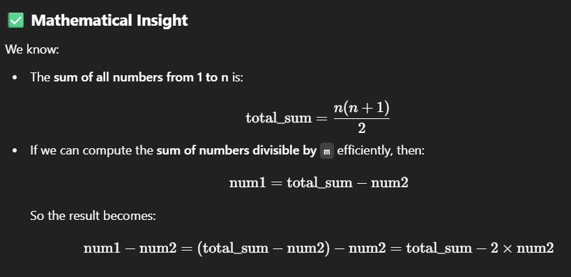
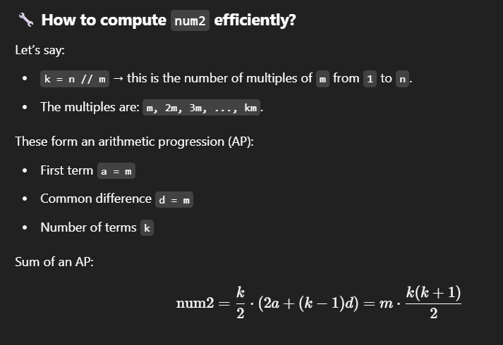

# [2894. Divisible and Non-divisible Sums Difference](https://leetcode.com/problems/divisible-and-non-divisible-sums-difference/description/?envType=daily-question&envId=2025-05-27)

Given two positive integers n and m, you need to:
- Compute `num1`: sum of all integers in `[1, n]` not divisible by `m`.
- Compute `num2`: sum of all integers in `[1, n]` divisible by `m`.
- Return `num1 - num2`

### Examples
```
Input: n = 10, m = 3
Output: 19

Input: n = 5, m = 6
Output: 15

Input: n = 5, m = 1
Output: -15
```

# Solution 1: Brute-force using loop with if-condition
```python
def differenceOfSums(n, m):
    num1, num2 = 0, 0
    for i in range(1, n + 1):
        if i % m == 0: num2 += i
        else: num1 += i
    return num1 - num2
```
Time Complexity: O(n) | Space Complexity: O(1)

# Solution 2: Using List Comprehensions and Built-in sum()
```python
def differenceOfSums(n, m):
    num1 = sum(i for i in range(1, n + 1) if i % m != 0)
    num2 = sum(i for i in range(1, n + 1) if i % m == 0)
    return num1 - num2
```
Time Complexity: O(n) | Space Complexity: O(n) (due to list comprehension)

# Solution 3: Optimized Mathematical Formula



```python
def differenceOfSums(n, m):
    total_sum = n * (n + 1) // 2
    k = n // m
    divisible_sum = m * k * (k + 1) // 2
    return total_sum - 2 * divisible_sum
```
Time Complexity: O(1) | Space Complexity: O(1)
> This is the most optimal and can be used in interviews

---

# 4. Using filter() and lambda functions (Functional Programming Style)
```python
def differenceOfSums(n, m):
    num1 = sum(filter(lambda x: x % m != 0, range(1, n + 1)))
    num2 = sum(filter(lambda x: x % m == 0, range(1, n + 1)))
    return num1 - num2
```
Time Complexity: O(n) | Space Complexity: O(n) (due to filter object)

> Conceptually different from loops and comprehensions; good for showcasing functional style.

# 5. Using collections.defaultdict (purely theoretical here)
This would be overkill, but for completeness:
```python
from collections import defaultdict

def differenceOfSums(n, m):
    bucket = defaultdict(list)
    for i in range(1, n + 1):
        key = 'div' if i % m == 0 else 'nondiv'
        bucket[key].append(i)
    return sum(bucket['nondiv']) - sum(bucket['div'])
```
Time Complexity: O(n) | Space Complexity: O(n)
> Different logic, but not practical. Useful only in multi-bucket classification.
